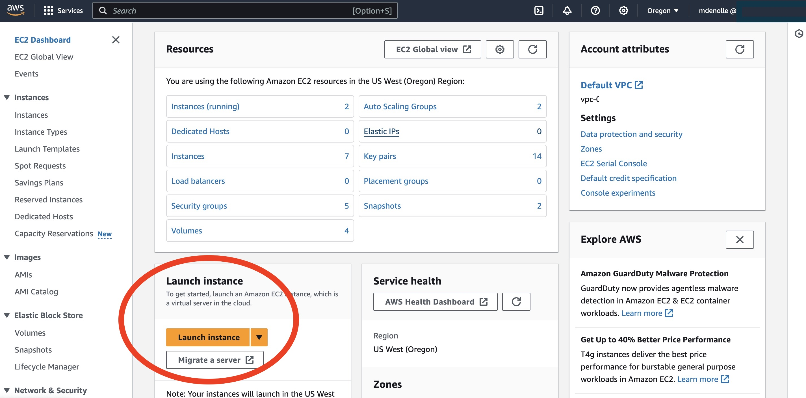
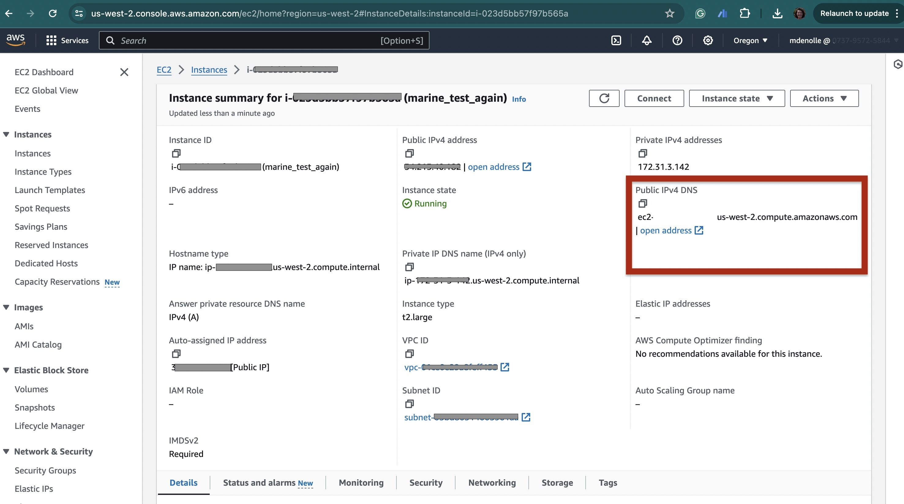

# AWS 101 

This tutorial will walk you thought getting on an AWS cloud instance from the ground up.

## What is Cloud Computing

[Presentation](https://docs.google.com/presentation/d/1E9_nGlHW8Rz2g4UrQMXyRVZ1UoxuSNejGmszf-OVDrI/edit?usp=drive_link) from Naomi Alterman (UW) and Rob Fatland (UW) and their video tutorial:
<iframe width="560" height="315" src="https://www.youtube.com/embed/S6X10HZDyrA?si=xMuZC5-VqMJjU9Rz" title="YouTube video player" frameborder="0" allow="accelerometer; autoplay; clipboard-write; encrypted-media; gyroscope; picture-in-picture; web-share" allowfullscreen></iframe>

## AWS web console access

:::{note}
For workshop participants:
1. Log in with your designated IAM User to this console: https://806812320051.signin.aws.amazon.com/console
2. Login with the username and temporary password sent to you prior to the workshop. 
3. As a first log in, the auto-generated password will need to be replaced. Use a sophisticated password to confirm with AWS security standards.
:::

### Choosing a region
An important aspect of cloud is that the computing and data centers are distributed around the world and labeled as "regions". For fastest connection to data storage on S3, we recommend to choose the region where the data is. 

To choose a region in AWS, follow these steps:

1. Log in to your AWS Management Console.
2. In the top-right corner, click on the current region name (e.g., "US East (N. Virginia)").
3. In the dropdown menu that appears, select a region (e.g., "US West (Oregon)").
4. After selecting the region, all AWS services you use will be hosted in that region.

:::{note}
Please use `US West (Oregon, us-west-2)` region for the tutorial.
:::

### Launching an instance
Launch an instance using **EC2 (Elastic Computing Cloud)**. Follow the steps below. Screen shots of the steps are linked [here](https://docs.google.com/presentation/d/1L49N8OL8vscjOkERC32l7H6K9IS-EeXOf6qerNEYxPs/edit?usp=sharing)

1. In the AWS Management Console, navigate to the **"EC2"** dashboard using the `Search` box on the top.
2. Click on **"Launch Instance"** to start the process of creating a new EC2 instance.



3. **Name and Tags**: Be specific for the best job management: ``FirstName_LastName_Jobname``
4. Choose a default **Application and OS Image**: ``Amazon linux``. You may also choose an Amazon Machine Image (AMI). 
5. **Instance Type**: This specify the RAM, vCPU, network, etc. `t2.xlarge` recommended.
6. **Key Pair**: create a new key pair. Download the .pem file, move it to a location that you can have access to and remember where it is. If the file does not save as `.pem`, replace the extension with `.pem`. You can re-use the key created before if you still have access to that key file.
    :::{note}
        For Windows users, download the type ED25519 and the `ppk` file.
    :::
7. **Network Settings**: ``Allow SSH traffic from `` -> ``My IP``.
    * **Select existing security group**, use `default`. This allows traffics in and out of the instance and is required for SSH (port 22) and jupyter notebook connection (port 8888).
8. **Configure Storage**, add more storage to your EC2 instance. 20 GiB will be sufficient for most workshop agenda.
9.  The rest is default and **launch instance**. Now the instance is launched, use the console to check.
10.  **View instance**, click on it -> Right click ->  connect -> SSH client. We will only go through step 3 and copying the ssh command line.
11.  Change the permission to your local PEM/PPK file to be only readable to you. Use terminal and change the permission by going into the folder where the PEM/PPK file:

    ```bash
    chmod 400 file.pem
    ```

12.  Login to the instance 

    a. On **Linux**, copy the ssh link command in the folder where the PEM file is below and ssh to the instance.
    ```bash
    ssh -i "file.pem" ec2-user@ec2.IP-ADDRESS
    ```
    
    b. On **Windows**, login to an EC2 instance using **PuTTY** (a free SSH client) on Windows:
    * Open PuTTY
    * On the PuTTY Configuration screen, click Session in the Category pane.
    * In the Host Name (or IP address) box, paste ``ec2-user@YOUR_Public IPv4 DNS`` YOUR_Public IPv4 DNS can be found in the details of your EC2 instance
    * Make sure Connection type: SSH is clicked
    * Back in the Category pane, expand Connection, expand SSH, and click Auth.
    * In the Private key file for AUTH/Credentials box, click browse and locate your ``.ppk`` file for the instance that you created and click. Depending on the version of Putty, 
    * Now click open and accept the connection.

## Environment Configuration
As you may notice, the EC2 you just launched has no user-specific software installed at all. We have two options to configure the computing environment for the EC2 instance.

:::{note}
For workshop participants:
Please follow Option 1 to install and use the Docker images. 
:::

### Option 1: Use Docker image on EC2
You can run codes within automatically generated Docker images.

1. To install docker, run the following command:

    ```bash
    sudo yum install docker -y
    sudo service docker start
    sudo usermod -a -G docker ec2-user
    docker --version
    ```

2. Pull the image. This will pull the Docker image named `seisscoped/seis_cloud` from the GitHub Container Registry.
    ```bash
    sudo docker pull ghcr.io/seisscoped/seis_cloud:centos7_jupyterlab
    ```

3. Run the docker image as container. This will launch a Jupyter Lab within the container. The command also forwards port 8888 from the container to port 8888 on the EC2 instance.
    ```bash
    sudo docker run -p 8888:8888 --rm -it ghcr.io/seisscoped/seis_cloud:centos7_jupyterlab
    ```

The jupyter lab will then running at port 8888.


### Option 2: Manual installation
Alternatively, you can manually configure your environment. To start from scratch, copy paste these commands in the terminal. You can copy the lines all at once and install the miniconda. 

```bash
sudo yum install -y git
wget https://repo.anaconda.com/miniconda/Miniconda3-latest-Linux-x86_64.sh
chmod +x Miniconda3-latest-Linux-x86_64.sh 
./Miniconda3-latest-Linux-x86_64.sh -b -p $HOME/miniconda
./miniconda/bin/conda init bash
bash
```

Now you can install your own software, i.e., clone your repository, install your environment, run your scripts. We will illustrate with this example 
```bash
git clone https://github.com/SeisSCOPED/seis_cloud
cd seis_cloud
conda create -y -n seiscloud python=3.10 pip
conda activate seiscloud
pip install -r requirements.txt
```
(update from github and overwrite local: git fetch + git merge)

To download files from your EC2 instance: 
```bash
scp -i "your.pem" ec2-user@ec2-publicIPAddress.us-west-2.compute.amazonaws.com:/home/ec2-user/seis_cloud/file .
```

If you are on Windows: 
```bash
C:\> pscp -i yourkey.ppk ec2-user@publicDNS:/home/ubuntu/yourfilename C:\[local_destination_path]\[folder]
```

To get the jupyter notebook running:
```bash
jupyter notebook --ip 0.0.0.0 --allow-root
```

:::{note}
If you run into this issue 
```bash
note: This error originates from a subprocess, and is likely not a problem with pip.
  ERROR: Failed building wheel for obspy
```
Type the following commmand to install it.
```bash
sudo yum groupinstall "Development Tools"
```
:::

## Access the Jupyter Lab/Notebook through browser
An EC2 instance has 2 IP addresses: one for the AWS internal networking system, one open to the public. To access the notebook, you need to connect on the public IP address. Open a browser, type the IP address of the instance (see the Public IPv4 DNS). Then type in the browser:
`publicIPaddress:8888`

You can find the public IP address on the web console




You will be prompted to window requesting for a token. On the EC2 instance terminal, you will see a link (or similar):
``http://127.0.0.1:8888/?token=LONG_TOKEN``

Copy and past the `LONG_TOKEN` in the token window and the jupyter lab/notebook will start.

:::{note}
There are alternative options to login:
1. Forward the ports when login in the instance:
    ```bash
    ssh -i "user.pem" user@publicIPaddress -L 8888:localhost:8888 -N
    ```
    
2. Open a browser and type localhost:8888/
:::

```{warning}
We have experienced exception. Safari and Chrome may treat the connection as malware. These are warnings and can be ignored (???) and find a way to continue.
```

## Save the virtual image (optional)

You can save the image (AMI) so that you can start from there next time. This can save time and effort in setting up the instance from scratch every time. Here are the steps to save the virtual image (AMI) of an EC2 instance in AWS:

In your AWS Management Console:
1. Navigate to the EC2 dashboard.
2. Select the EC2 instance that you want to save the image of.
3. Right-click on the instance and click on "Create Image" in the dropdown menu.
4. In the "Create Image" dialog box, enter a descriptive name for your image in the "Name" field. For this workshop, please use the format <strong>"FirstName_LastName_Image_TutorialX"</strong>.
5. Optionally, you can add a description and tags to the image for easier management later on.
6. Click on the "Create Image" button to start the image creation process.
7. Wait for the image creation process to complete. This may take several minutes depending on the size of your instance and the amount of data being saved.
8. Once the image has been created, it will appear in the "AMIs" section of the EC2 dashboard.

You have to save it every time you want to save the current state of the instance

## Terminating an instance

What is the difference between stop and terminate and instance: saving data vs cost. If you stop, you do not pay for the hardware, but you will pay for the EBS volume only and the data is saved in the EBS volume. If you terminate, all data will be wiped and you will cease to pay.
:::{note}
Visit [here](https://docs.rightscale.com/faq/clouds/aws/Whats_the_difference_between_Terminating_and_Stopping_an_EC2_Instance.html) to read more about stopping vs terminating.
:::
