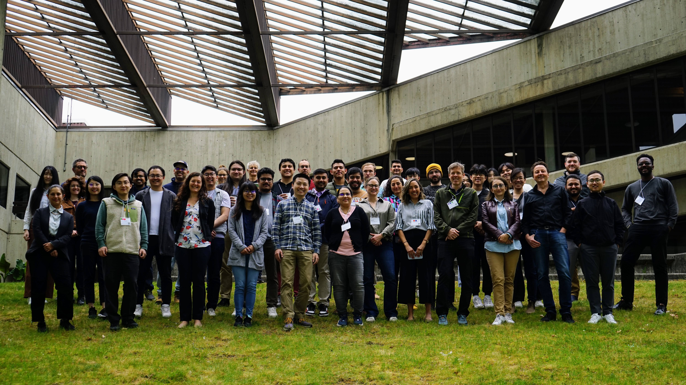

# SCOPED Workshop (2024)

The SCOPED workshop is happening in May 20-24, 2024 at the University of Washington. The workshop brings 50 participants & instructors in person, and provides remote access to about 100 participants. The workshop schedule is ambitious with full wavefield modeling, inversion, source characterization using source inversion and machine learning approaches. In-person participants will be running research-grade software on AWS cloud and on Frontera super computer. Remote participants will be running similar software locally, using our containerized technology.

Check out the schedule [here](https://seisscoped.org/workshop-2024)

Introduction slides:
<iframe src="https://docs.google.com/presentation/d/e/2PACX-1vRdGd5F49At8RITKrLnSvHo9Ag9OR8OPfWu9P5ahGsxhU4DSqNfLt20MC43RpOrXWvnsVDenuEngOSu/embed?start=true&loop=false&delayms=3000" frameborder="0" width="960" height="569" allowfullscreen="true" mozallowfullscreen="true" webkitallowfullscreen="true"></iframe>