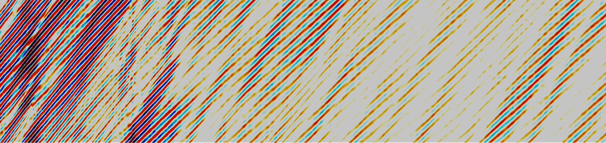

# Welcome to the HPS Jupyter Book!

📖 On this JupyterBook website, you will find resources for high-performance computing tailored to seismological research. In particular, we talk about two types of large-scale seismological research:
* Wavefield and earthquake simulations
* Big Data Mining

Both leverage two computing architectures: HPC and Cloud. This book provides training for best practices in computing and software environment.

## SSA Workshop 2024 Data Mining and Cloud 101 - information

This workshop will introduce participants to cloud computing, from concept and best practices to practice, for two main approaches of data mining in seismology: correlation seismology and machine learning. Participants will learn how to port their Python scripts from their laptops to the cloud, analyze their intermediate data products, and download the final data product. Participants will learn ambient noise seismology software noise and run it on cloud-hosted data sets of broadband seismometers and distributed acoustic sensing data. Participants will learn machine learning in seismology (earthquake catalog building and data discovery of various geohazards). The workshop curriculum is supported by the NSF project SCOPED.

### SCHEDULE

| Time | Topics | Instructors |  Link to notebook or slides |
| --- | --- | ---| --- |
| 9:00-9:30m |  Welcome  | Marine Denolle and Felix Waldhauser| |
| 10:00-11:15am | Cloud 101 | Yiyu Ni, Zoe Krauss, Marine Denolle | https://github.com/SeisSCOPED/seis_cloud, [book](./chapters/cloud/AWS_101.md)|
| 11:15-12:30 | Ambient Noise | Yiyu Ni, Kuan-Fu Feng, Marine Denolle | https://github.com/SeisSCOPED/noisepy, [book](./chapters/noise/noisepy.md)|
| 12:30 - 1:30pm| Lunch Break ||
| 1:30 - 2:30 pm | QuakeCatalog Building |  Kaiwen Wang ||
| 2:30 - 3:30 pm | Event Discimination with ML | Akash Kharita | |
| 3:30 - 3:40 pm  | Coffee Break ||
| 3:40 - 5:00pm | Unsupervised Learning | Theresa Sawi | SPECUFEX| 

